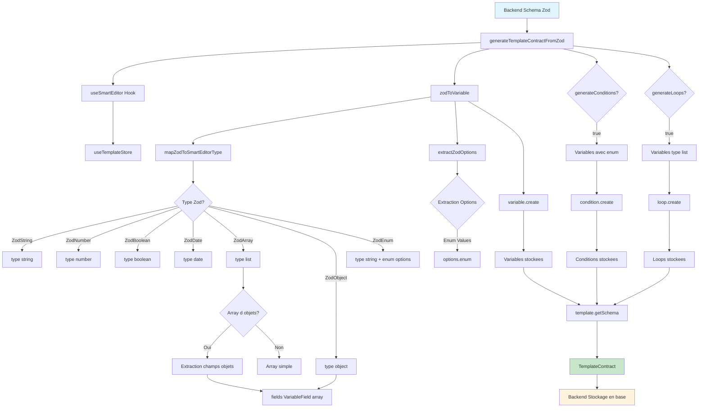

# Flow Backend - Génération TemplateContract depuis Zod

## Description du Flow

### 1. **Input Backend**
- Le backend fournit un schéma Zod (ex: `fundraisingSchema`)
- Appelle `generateTemplateContractFromZod(schema, options)`

### 2. **Traitement Zod → SmartEditor**
- **`zodToVariable`** : Convertit chaque champ Zod en Variable SmartEditor
- **`mapZodToSmartEditorType`** : Mappe les types Zod vers les types SmartEditor
- **`extractZodOptions`** : Extrait les métadonnées fonctionnelles (enum, etc.)

### 3. **Gestion des Types Complexes**
- **Objets** : Extraction récursive des champs → `fields: VariableField[]`
- **Arrays d'objets** : Extraction des champs de l'objet → `fields: VariableField[]`
- **Enums** : Extraction des valeurs possibles → `options.enum`

### 4. **Création via API SmartEditor**
- **`variable.create`** : Crée les variables dans le store
- **`condition.create`** : Crée les conditions (si `generateConditions: true`)
- **`loop.create`** : Crée les loops (si `generateLoops: true`)

### 5. **Output Backend**
- **`template.getSchema`** : Récupère le TemplateContract final
- Le backend stocke ce contrat en base de données
- Réutilisable par d'autres services

## Avantages de cette Architecture

✅ **Découplage** : Le backend n'utilise pas directement React
✅ **Réutilisabilité** : Même API SmartEditor pour frontend et backend
✅ **Flexibilité** : Options pour activer/désactiver conditions et loops
✅ **Cohérence** : Même structure de données partout
